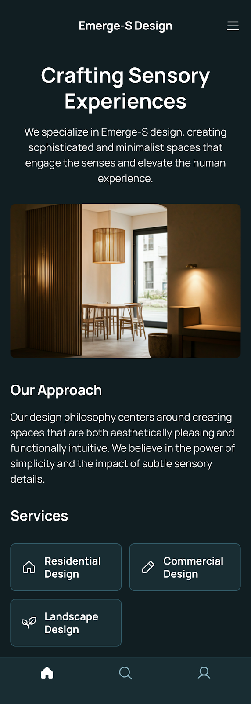

# Emerge-S Design | Immersive Design

Google Stitch로 디자인한 "Emerge-S Design" UI - Railway 배포 프로젝트



## 🎨 프로젝트 소개

감각적인 경험을 창조하는 Emerge-S 디자인 회사의 웹사이트입니다. 세련되고 미니멀한 공간을 만들어 감각을 자극하고 인간 경험을 향상시키는 것을 전문으로 합니다.

### 주요 서비스
- 🏠 **주거 디자인** (Residential Design)
- ✏️ **상업 디자인** (Commercial Design)
- 🌱 **조경 디자인** (Landscape Design)

## 🚀 Railway 배포

### 배포 방법

1. **Railway 사이트 접속**
   - https://railway.app 방문 및 로그인

2. **프로젝트 생성**
   - "New Project" 클릭
   - "Deploy from GitHub repo" 선택
   - 이 리포지토리 선택

3. **브랜치 설정**
   - 배포할 브랜치 선택
   - Railway가 자동으로 감지하고 배포 시작

4. **환경 변수** (선택사항)
   - 기본 PORT 설정이 자동으로 적용됨
   - 추가 환경 변수 필요 시 Settings에서 설정

5. **도메인 설정** (선택사항)
   - Settings → Domains
   - 커스텀 도메인 추가 가능

### 자동 배포
- `package.json`을 자동 감지
- Node.js 환경 자동 설정
- `npm start` 명령어로 서버 실행
- 코드 푸시 시 자동 재배포

## 📁 프로젝트 구조

```
ImmersiveDesign/
├── index.html          # Google Stitch UI 디자인 메인 페이지
├── screen.png          # 프리뷰 이미지
├── server.js           # Express 정적 파일 서버
├── package.json        # Node.js 의존성 및 스크립트
├── railway.json        # Railway 배포 설정
├── .gitignore          # Git 제외 파일
└── README.md           # 프로젝트 문서
```

## 🛠️ 기술 스택

- **프론트엔드**: HTML5, Tailwind CSS
- **백엔드**: Node.js, Express.js
- **폰트**: Google Fonts (Manrope, Noto Sans)
- **아이콘**: Phosphor Icons (SVG)
- **배포**: Railway

## 💻 로컬 개발

### 설치 및 실행

```bash
# 의존성 설치
npm install

# 개발 서버 실행
npm start

# 브라우저에서 확인
# http://localhost:3000
```

### 개발 환경 요구사항
- Node.js 14.0.0 이상
- npm 또는 yarn

## 🎨 디자인 특징

- **다크 테마**: 세련된 다크 배경 (#111e22)
- **반응형 디자인**: 모든 디바이스에 최적화
- **미니멀리즘**: 깔끔하고 직관적인 인터페이스
- **Tailwind CSS**: 유틸리티 퍼스트 CSS 프레임워크
- **모던 레이아웃**: Flexbox 및 Grid 시스템 활용

## 📱 기능

- **네비게이션**: 상단 메뉴 및 하단 탭 바
- **서비스 카드**: 3가지 주요 서비스 소개
- **이미지 갤러리**: 반응형 이미지 디스플레이
- **아이콘 시스템**: SVG 기반 Phosphor 아이콘

## 🔗 배포 URL

배포 완료 후 Railway에서 제공하는 URL:
```
https://your-project-name.up.railway.app
```

## 📚 참고 자료

- [Railway 문서](https://docs.railway.app)
- [Express.js 문서](https://expressjs.com)
- [Tailwind CSS 문서](https://tailwindcss.com)
- [Google Fonts](https://fonts.google.com)

## 📝 라이센스

MIT License

---

**Created with Google Stitch** | Deployed on Railway
